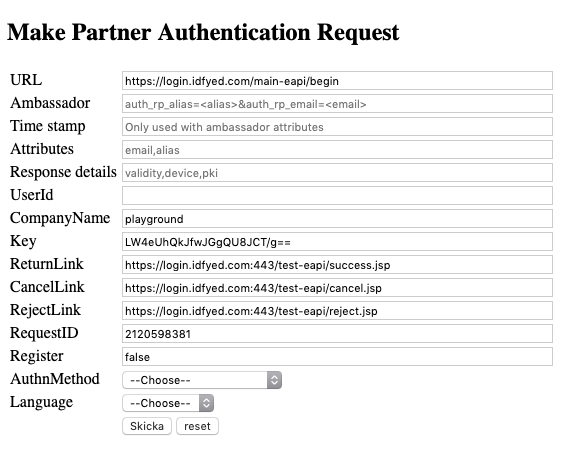
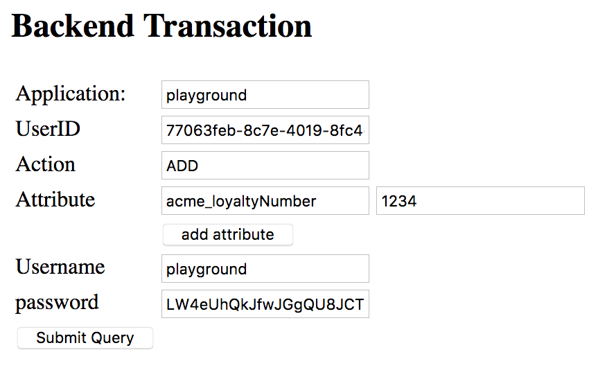

## Abstract

Diglias Playground is a set of instructions, documentation and tools that can be used by a Diglias customer during
evaluation of the Diglias services. It is not a complete integration instruction. Using the playground it is possible
to develop a web application that uses Diglias for authentication and identification of users.

## Intended Audience

The Diglias Playground is intended primarily for technically minded persons that needs to understand the technical
structure of the Diglias service and how to integrate it in the customer environment.

## API Documentation

A good starting point is to get familiar with the different integration points are through the API documentation. A
number of concepts and terms referred to in the remainder of this document is explained in the documentation:

* [EAPI - Authentication and Frontend connect](https://test.diglias.com/doc-rp/eapi.jsp)
* [RP Mgmt - Backend connect](https://test.diglias.com/doc-rp/rp-mgmt.jsp)

## Install the App

To install the app you can either click the icons above in your browser of your device or open the App store or Play
Store App on the device and search for “Diglias”.

## Playground Relying Party

To allow evaluation and practical test of the API and the service a test relying party (RP) has been set up in the
production environment. The RP is the fictitious company ACME Inc.

### Relying Party Configuration

The playground relying party uses Diglias for authentication.

|                | Parameter       | Value                  |
|----------------|---------------- |------------------------|
|Customer Id     |auth_companyname |playground              |
|Company MAC Key |N/A              |LW4eUhQkJfwJGgQU8JCT/g==|

### Attributes

The playground relying party will request the following information from users logging in:

|Attribute                 |Attribute name      |Comment            |
|--------------------------|--------------------|-------------------|
|Fictitious loyalty number |`acme_loyaltyNumber`|Optional - verified
|Nickname                  |`nickname`          |Mandatory - non-verified
|Country                   |`c`                 |Mandatory - non-verified

### API Endpoint

To be able to integrate with the playground the API endpoint (<https://login.diglias.com/main-eapi/begin>) should be
used. This is necessary for the playground login to work properly with the playground version of the app and the relying
party configurations.

## Try Login

Using the form at <https://login.diglias.com/test-eapi/> a login can be emulated. This webform performs an operation
that normally would be done by the application integrating Diglias for authentication and identification.

In the form the CompanyName `playground`, and the key `LW4eUhQkJfwJGgQU8JCT/g==` should be entered. All other values
can be kept as default.

## Try Connect

In some scenarios, adding an attribute to a user where the RP decides the value is required. This scenario is called a
`connect`. For example if you join a loyalty program, the RP might want to add the loyalty program number to your
Diglias profile.

The playground RP has been equipped with the possibility to connect the attribute `acme_loyaltyNumber` and this can be
done in two ways.

* **Frontend connect** - Adding the new parameter in the EAPI request. This is the fastest integration choice, this is
also the only choice in any case where the user is previuosly unknown to Diglias.
* **Backend connect** - the application calls an authenticated backend channel over REST adding the attribute to the
user. User will then be prompted to add the attribute to the Diglias profile.

### Try Frontend connect

Using the form at <https://login.diglias.com/test-eapi/> as in "Try Login" plus filling out the `Ambassador` part of the
form, frontend connect can be emulated. Try to add `auth_rp_acme_LoyaltyNumber=1234` in `Ambassador` field to accomplish
the task to add 1234 as loyalty number.

For more information, see EAPI documentation metioned above	 under the section with `auth_rp_ATTRIBUTE`.

### Try Backend connect

Using the form at (<https://login.diglias.com/test-rp-mgmt/>) backend connect can be emulated. The web-form is a simple
wrapper for the REST API call that exposes backend connect API. 

This call will notifiy the user with userid `77063...` to add `acme_loyaltyNumber` to the profile. The userId is fetched
from a previous authentication of the user in "Try Login".

This is the preferred way to add and the only way to do remove of user attributes and is also the most user friendly way
for connect.

Backend connect requires a number of parameters seen in the screen dump, below is a description of each. See
documentation for more details.

| attribute       | value |
|-----------------|-------|
|application      |playground|
|UserID           |The user id returned when user logs into `playground` using EAPI|
|action           |ADD/REMOVE. Note: it is only the `acme_loyaltyNumber` that can be added and removed, the RP is not allowed any other modifications on the user.
|attribute(name)  |`acme_loyaltyNumber`
|attribute(value) |loyalty number of your choice
|Username		      |`playground`	
|password		      |`LW4eUhQkJfwJGgQU8JCT/g==`	

## Sample Code

A sample web application that demonstrates the different possibilities exposed by the service.

|Platform             |Repository                    |
|-------------------- |-------------------------------------------|
|PHP                  |<https://github.com/diglias/sample-php-app>|
|node.js / Javascript |<https://github.com/diglias/sample-node-app>|

You need sample code for a platform not listed? Let us know!

## Contact & Feedback

If you have any questions, improvement suggestions or any other reason to talk to us; please don’t hesitate to contact
us:

<playground@diglias.com>
